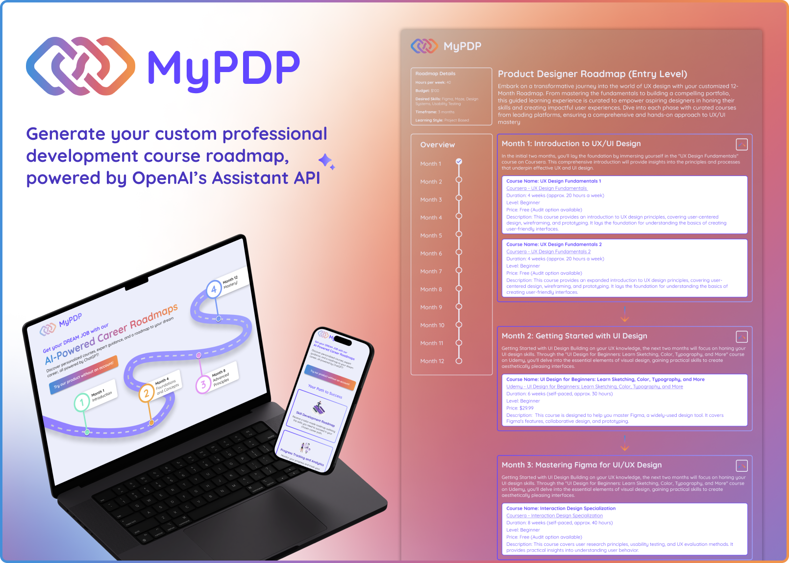

## MyPDP

My Professional Development Plan is a web application that empowers users to navigate their career path with a personalized roadmap. By tailoring learning paths to indivdual needs and goals, the appliication helps users upskill and advance their careers You can check out the live project [here](https://career-coach.netlify.app).

## Features
- ⚒️ **Personalized Roadmaps** Users complete a quick survey outlining their desired career goals, available time for learning, and budget constraints. Based on this information, the app generates a customized roadmap with the courses they should take to achieve their goals.
- 🎓 **Motivational Quotes** Stay inspired with a dynamic loading screen that displays a new inspirational quote every 20 seconds while the roadmap is being built.

## Tech Stack
- &nbsp;&nbsp;&nbsp;&nbsp;&nbsp;FastAPI

- &nbsp;&nbsp;&nbsp;&nbsp;&nbsp;Python

- &nbsp;&nbsp;&nbsp;&nbsp;&nbsp;TypeScript

-  &nbsp;&nbsp;&nbsp;&nbsp;&nbsp;React   

